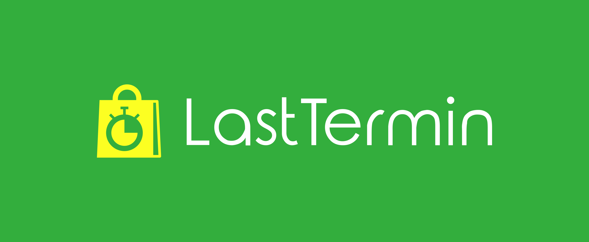
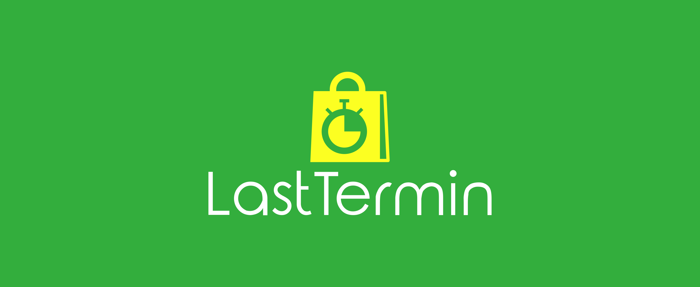

# logo
logotyp
https://lasttermin.github.io/logo/example.html

## Colors

### Background

  #33AE3D

### Text

  #FFFFFF

### Icon

  #FCFF22

## Font
Rounded_Elegance.woff

 Sans serif
 
  

        Font in use <a target="_blank" href="https://www.dafont.com/rounded-elegance.font">Rounded_Elegance</a> designed by
        <a target="_blank" href="mailto:dcc700@gmail.com">Genumano</a>
        and licensed under
        <a target="_blank" href="https://www.dafont.com/faq.php#copyright">100% Free.</a>
          Icon Designed by
          <a target="_blank" href="https://thenounproject.com/pongsakorn_tantiyakorn">pongsakorn</a>

          
          
## CSS
style.css

    @font-face {
      font-family: 'Rounded Elegance Regular';
      font-style: normal;
      font-weight: normal;
      src: local('Rounded Elegance Regular'), url('Rounded_Elegance.woff') format('woff');
    }

    /* Background */
    .green {
      color: #33AE3D;
    }
    /* Text */
    .white {
    color: #FFFFFF;
    }

    /* Icon */
    .yellow {
      color: #FCFF22;
    }
# Logo

## 1

## 2

